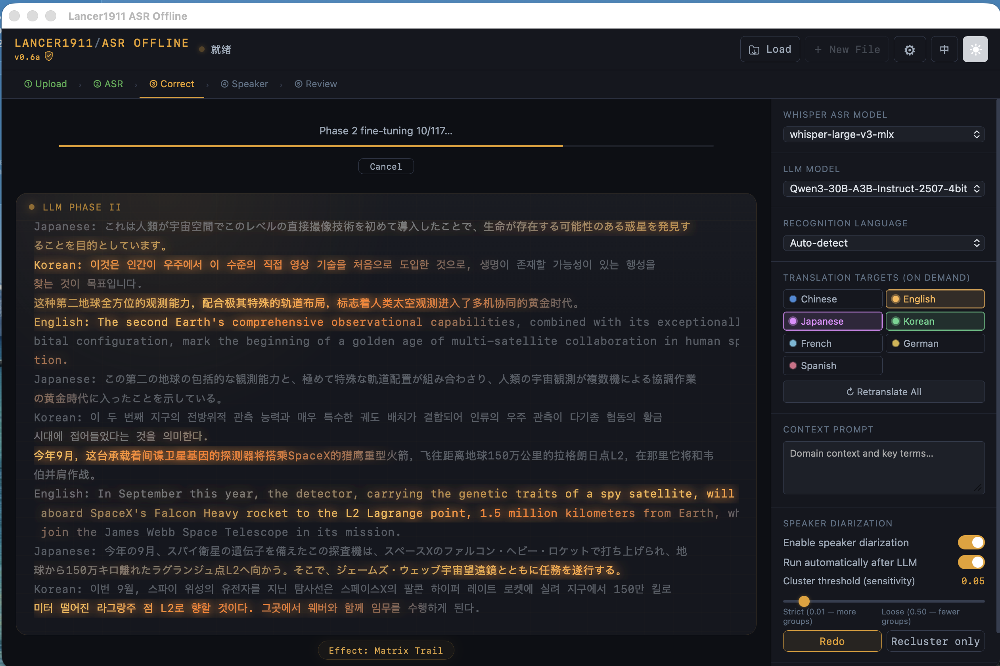
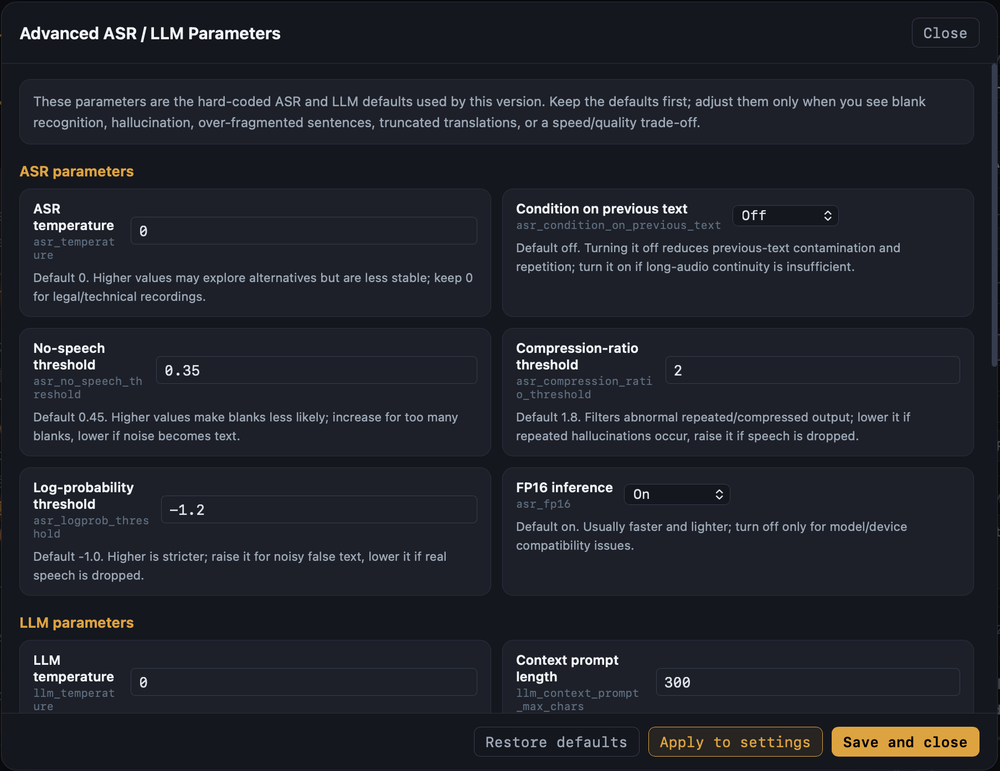
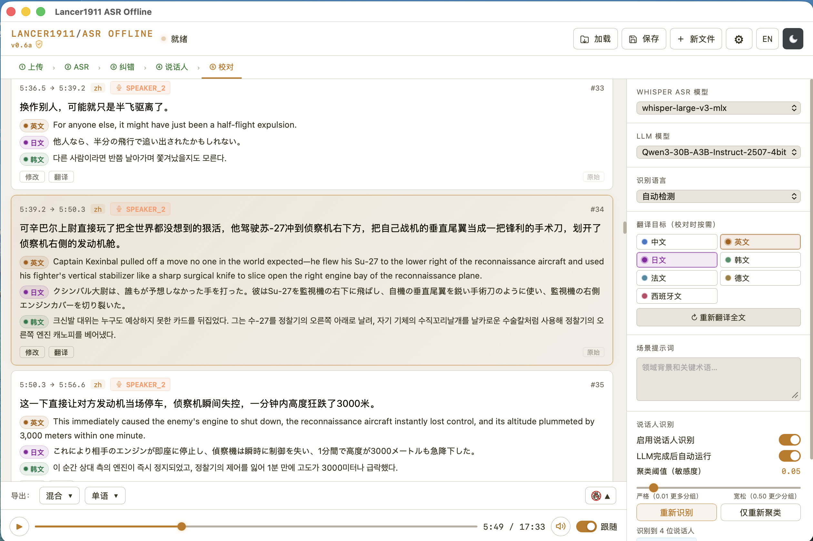

🌐 [中文说明](README-ZH.md)

# Lancer1911 ASR Offline

> Fully offline audio/video transcription, LLM semantic correction, multilingual translation, and speaker diarization  
> Built for Apple Silicon — designed for meeting recordings, interviews, hearings, lectures, video files, and long-form local batch processing


---

## ⚠️ Hardware Requirements

Lancer1911 ASR Offline runs Whisper ASR, a Qwen3 LLM, and optionally a local speaker-embedding model entirely on your Mac. Audio and transcript data are not uploaded to the cloud, but this also means all active models and working buffers must fit in local unified memory.

| | Minimum | Recommended |
|---|---|---|
| **Chip** | Apple M1 | M2 Pro / M3 / M4 or later |
| **Unified Memory** | **24 GB** | **48 GB** |
| **Storage** | 15 GB free | 30 GB free; more recommended for long media files |
| **macOS** | 13 Ventura | 14 Sonoma or later |

> **Why 24 GB or more?** The default model stack typically includes `whisper-large-v3-turbo` and `Qwen3-14B-4bit`. ASR, LLM inference, pywebview, FastAPI, audio buffers, subtitle entries, and export data all share the same memory pool. A 16 GB Mac may handle short jobs with smaller models, but long audio, multilingual translation, or larger LLMs can cause heavy swapping, slowdowns, or crashes. If you only have 16 GB, use a smaller LLM and disable speaker diarization and multilingual translation.

---

## Screenshots

<p align="center">
  
  <br><em>Main interface — drag-and-drop upload, processing phases, subtitle review, and translation</em>
</p>

<p align="center">
  
  <br><em>Advanced settings — ASR / LLM parameters, built-in presets, and custom presets</em>
</p>

<p align="center">
  
  <br><em>Review interface — subtitle cards, raw ASR, per-entry translation, playback sync, and export</em>
</p>

---

## Features

- **Fully offline** — Transcription, semantic correction, translation, and speaker diarization run locally. Your media and text never leave your Mac.
- **File-based offline workflow** — Drop an audio or video file, let the app inspect and convert it, then run ASR, LLM correction, optional translation, and optional diarization.
- **Common media formats** — Supports MP3, MP4, M4A, WAV, FLAC, AAC, OGG, and other formats decodable by ffmpeg.
- **Whisper ASR** — Defaults to `mlx-community/whisper-large-v3-turbo`; supports language auto-detection or locking to Chinese, English, Japanese, Korean, or Cantonese.
- **Two-phase LLM correction** — Qwen3 or another MLX LLM performs semantic correction, punctuation restoration, sentence segmentation, and terminology repair.
- **Multilingual translation** — Translation targets include Chinese, English, Japanese, Korean, French, German, and Spanish. The app can auto-fill missing translations after loading a session and can retranslate the whole transcript on demand.
- **Subtitle-card review** — Each subtitle entry can be edited, saved, saved-and-translated, translated individually, or compared with its raw ASR text.
- **ASO session files** — Save a complete `.aso` session containing entries, translations, speaker labels, settings, debug data, and source-audio metadata. When reloaded, the app can auto-pair the original media if it is in the same folder.
- **Playback sync** — The backend serves a WAV generated from the same 16 kHz audio used for ASR. The UI supports play/pause, seeking, volume control, click-to-jump, and follow-playback highlighting.
- **Speaker diarization** — Optional local speaker clustering with automatic post-LLM execution, manual re-run, reclustering, speaker renaming, and per-card reassignment.
- **Advanced ASR / LLM parameters** — A top-bar gear button opens controls for ASR thresholds, LLM token budgets, chunk sizes, and temperature.
- **Parameter presets** — Built-in presets include Default / Balanced, Distant / Muffled Recording, Noisy / Hallucination Control, Long Sentences / Multilingual Translation, Speed First, and Quality First. Users can also save, overwrite, and delete custom presets.
- **Sci-fi processing preview** — During processing, the app can display intermediate ASR / LLM text streams with either Aurora Flow or Matrix Trail foreground text effects.
- **Debug output** — Optional debug output writes intermediate ASR, LLM, translation, and diarization data to `~/Downloads` for troubleshooting.
- **Multi-format export** — Export SRT, TXT, Markdown, and JSON, either as mixed-language output or a selected single language.
- **Bilingual UI** — Switch between Chinese and English with the top-bar language button.
- **Dark / light theme** — Toggle the UI appearance from the top bar.

---

## Quick Start

### 1. Clone or unpack the project

```bash
git clone https://github.com/lancer1911/ASR-Offline.git
cd ASR-Offline
```

If you are using a ZIP distribution, simply unzip it and enter the project folder.

### 2. Install system dependencies

```bash
brew install ffmpeg
```

`ffmpeg` and `ffprobe` are used to inspect media files, extract audio, and convert them to 16 kHz mono f32 PCM for ASR.

### 3. Create the runtime environment

A dedicated environment is recommended:

```bash
python3 -m venv ~/asr-offline-env
source ~/asr-offline-env/bin/activate
pip install --upgrade pip setuptools wheel
pip install -r requirements.txt
```

If you already use `~/asr-env` for a related ASR project, the packaged launcher will also try to locate that environment automatically.

### 4. Download the ASR model

```bash
# Recommended default: good speed / quality balance
hf download mlx-community/whisper-large-v3-turbo

# Optional: higher accuracy, slower
# hf download mlx-community/whisper-large-v3-mlx
```

### 5. Download the LLM

```bash
# Recommended default for 24 GB+ unified memory
hf download mlx-community/Qwen3-14B-4bit

# Optional: higher quality; recommended for 48 GB+ unified memory
# hf download mlx-community/Qwen3-30B-A3B-Instruct-2507-4bit
```

Once downloaded, models are cached under `~/.cache/huggingface/hub/` and can be used offline.

### 6. Speaker diarization dependencies (optional)

The current offline build uses local speaker embeddings / clustering. Install the optional dependencies if needed:

```bash
source ~/asr-offline-env/bin/activate
pip install resemblyzer scipy
```

If you installed from `requirements.txt`, these are usually already present. Diarization increases processing time and can be disabled for long jobs or low-memory systems.

### 7. Launch

```bash
source ~/asr-offline-env/bin/activate
python main.py
```

The app starts a local FastAPI service and opens a pywebview desktop window. The default local service is:

```text
http://127.0.0.1:17434
```

The first launch may take 30–60 seconds while the ASR and LLM models are loaded. Drop a file once the status bar indicates readiness.

---

## Basic Workflow

### 1. Upload a file

Drag an audio or video file onto the upload area, or click to select a file. The app first calls `ffprobe` to inspect duration, format, sample rate, channels, and bitrate, then uses `ffmpeg` to convert the source into temporary 16 kHz mono f32 audio.

### 2. Start transcription

After the file passes inspection, click **Start Transcription**. The normal workflow is:

```text
① Upload → ② ASR → ③ LLM Correction → ④ Speaker ID (optional) → ⑤ Review
```

ASR produces raw text and timestamps. The LLM performs semantic correction, segmentation, and translation-field generation. Speaker diarization, if enabled, clusters voices based on the audio and subtitle timing.

### 3. Review subtitles

In the review interface, each subtitle card supports:

- viewing corrected text;
- expanding raw ASR text;
- translating the entry;
- editing and saving;
- saving and retranslating;
- changing the speaker label;
- clicking the card to jump to the corresponding audio position.

### 4. Retranslate the full transcript

After selecting target languages in the right-side settings panel, click **Retranslate All**. Existing translations are cleared and regenerated according to the current target-language selection. This is useful for adding new languages after loading an older ASO session.

### 5. Save the session

Click **Save** in the top bar to write a `.aso` session file. It is best to keep the `.aso` file and the original media file in the same folder. When the session is reloaded, the app attempts to locate and pair the original media automatically; if it cannot, you will be prompted to select it manually.

---

## Settings

### Whisper ASR Model

The dropdown lists locally available Whisper / MLX ASR models. The recommended default is:

```text
mlx-community/whisper-large-v3-turbo
```

### LLM Model

The dropdown lists locally available MLX LLMs. The recommended default is:

```text
mlx-community/Qwen3-14B-4bit
```

Larger models can improve correction and translation quality, but they also increase memory use and processing time.

### Recognition Language

Options include:

| Option | Use case |
|---|---|
| Auto | Multilingual or unknown-language files |
| Chinese | Chinese meetings, lectures, interviews |
| English | English meetings or videos |
| Japanese | Japanese audio |
| Korean | Korean audio |
| Cantonese | Cantonese audio |

For monolingual recordings, locking the language can reduce mis-detection.

### Translation Targets

You can select multiple target languages. More target languages require more LLM output fields, increase latency, and may require larger token budgets. If translation is truncated, increase the translation token budgets in Advanced Settings.

### Context Prompt

Use this field to provide domain background, names, and terminology. Direct term lists are usually more effective than long prose descriptions.

```text
Patent hearing. Terms: claims, specification, inventive step, prior art, doctrine of equivalents, prosecution history estoppel, invalidation.
```

```text
Medical interview. Terms: atrial fibrillation, coronary artery, ejection fraction, HbA1c, eGFR.
```

### Speaker Diarization

| Parameter | Default | Notes |
|---|---:|---|
| Enable Speaker ID | Off | Runs voice clustering after LLM correction |
| Run automatically after LLM | On | Disable this if you prefer manual control |
| Clustering threshold | 0.05 | Lower is stricter and may create more speakers; higher is more lenient and may merge speakers |

If one speaker is split into multiple identities, increase the threshold and click **Recluster Only**. If different speakers are merged, decrease the threshold or re-run diarization.

---

## Advanced ASR / LLM Parameters

Click the gear button in the top bar to open Advanced Settings. Unless you are troubleshooting a specific issue, use the defaults or one of the built-in presets.

### ASR Parameters

| Parameter | Default | Meaning |
|---|---:|---|
| `asr_temperature` | `0.0` | ASR sampling randomness. Keep at 0 for stable transcription. |
| `asr_condition_on_previous_text` | `false` | Whether Whisper conditions on previous text. Off reduces previous-text contamination, repetition, and hallucination; turn on only if long-context continuity is insufficient. |
| `asr_no_speech_threshold` | `0.45` | No-speech detection threshold. Lower it for distant, muffled, or quiet recordings; raise it for noisy files. |
| `asr_compression_ratio_threshold` | `1.8` | Filter for repetitive / abnormal output. Lower it to suppress repetition; raise slightly if real speech is being filtered. |
| `asr_logprob_threshold` | `-1.0` | Confidence threshold. Lower to around -1.2 for weak audio; raise to around -0.8 to reduce hallucination. |
| `asr_fp16` | `true` | Half-precision inference. Usually keep enabled on Apple Silicon. |

### LLM Parameters

| Parameter | Default | Meaning |
|---|---:|---|
| `llm_temperature` | `0.0` | LLM randomness. Keep at 0 for correction and translation. |
| `llm_context_prompt_max_chars` | `300` | Maximum context-prompt length injected into LLM prompts. Increase if you have many terms. |
| `llm_phase1_chunk_max_chars` | `350` | Phase 1 chunk size. Smaller chunks mean more calls; larger chunks may reduce stability. |
| `llm_phase1_max_tokens` | `1200` | Phase 1 output budget. Increase if long text is truncated. |
| `llm_phase1_min_length_ratio` | `0.5` | Tolerance ratio for Phase 1 output that is unexpectedly short. |
| `llm_phase2_base_max_tokens` | `1200` | Base output budget for Phase 2. |
| `llm_phase2_tokens_per_target_lang` | `600` | Additional Phase 2 budget for each translation target. |
| `llm_translate_base_tokens` | `800` | Base token budget for per-entry / batch translation. |
| `llm_translate_tokens_per_target_lang` | `350` | Additional per-entry translation budget per target language. |
| `llm_translate_max_tokens_cap` | `2400` | Cap for per-entry translation token budget. |

### Built-in Presets

| Preset | Best for |
|---|---|
| Default / Balanced | General recordings and stable behavior |
| Distant / Muffled Recording | Quiet, distant, or unclear speech; reduces missed speech |
| Noisy / Hallucination Control | Noisy audio, fake words, repeated output |
| Long Sentences / Multilingual Translation | Long utterances or many target languages |
| Speed First | Smaller token budgets and faster processing |
| Quality First | Larger token budgets for more complete output |

You can save the current values as a custom preset. Custom presets are stored in the local settings file:

```text
~/.asroffline_settings.json
```

---

## ASO Session Files

`.aso` is the complete session format for Lancer1911 ASR Offline. It typically contains:

- subtitle entries;
- raw ASR text and timestamps;
- LLM-corrected text;
- translations;
- speaker labels and custom speaker names;
- current settings;
- source-media filename, duration, format, and related metadata;
- debug-panel data.

Recommended folder layout:

```text
ProjectFolder/
├── interview_2026-05-07.mp3
└── interview_2026-05-07.aso
```

When loading an `.aso`, the app tries to find the original media in the same folder and restore playback automatically. If it cannot, you can manually pair the media file when prompted.

---

## Export

Use the export menu to choose mixed-language or single-language output.

| Format | Description |
|---|---|
| SRT | Standard subtitle format for video editors |
| TXT | Plain text with timestamps |
| Markdown | Suitable for Obsidian, Notion, reports, and notes |
| JSON | Complete structured data for downstream processing |

Mixed-language export includes original text, translations, speaker labels, and timestamps. Single-language export lets you choose from languages present in the transcript or translation fields.

---

## Packaging as a macOS .app

The project uses a lightweight shell-app design. The `.app` contains the project code and static assets, but does not embed MLX, model weights, or heavy Python dependencies. On launch, it locates an external Python environment and runs the actual backend there.

### 1. Prepare the runtime environment

```bash
python3 -m venv ~/asr-offline-env
source ~/asr-offline-env/bin/activate
pip install --upgrade pip setuptools wheel
pip install -r requirements.txt
```

### 2. Prepare the build environment

```bash
python3 -m venv ~/asr-offline-build-env
source ~/asr-offline-build-env/bin/activate
pip install --upgrade pip setuptools wheel py2app
```

### 3. Build

```bash
rm -rf build dist
python build_mac.py py2app
```

The generated application is:

```text
dist/Lancer1911 ASR Offline.app
```

### 4. First-launch Gatekeeper warning

If macOS blocks the app, run:

```bash
xattr -cr "/Applications/ASR Offline.app"
```

Alternatively, right-click the app → Open → click Open again in the dialog.

Application logs are written to:

```text
~/Library/Logs/ASROffline.log
```

---

## FAQ

**The app stays on “Connecting” for a long time.**  
The first launch loads ASR and LLM models into memory. Wait until the status bar shows readiness. If it takes several minutes, check `~/Library/Logs/ASROffline.log`.

**The local port is already in use.**  
The default port is 17434. Check it with:

```bash
lsof -i :17434
```

Terminate the process if needed:

```bash
lsof -ti :17434 | xargs kill -9
```

**Upload fails or media decoding fails.**  
Confirm ffmpeg is installed:

```bash
ffmpeg -version
ffprobe -version
```

A video file without an audio stream will also fail inspection.

**No translations appear.**  
Confirm target languages are selected and settings are saved. If you loaded an older ASO file, click **Retranslate All**. If the issue persists, enable debug output and inspect the LLM JSON files in `~/Downloads`.

**Distant or muffled recordings miss speech.**  
Use the **Distant / Muffled Recording** preset, or try `no_speech_threshold = 0.35`, `logprob_threshold = -1.2`, and `compression_ratio_threshold = 2.0`. If hallucinations increase, tighten the values gradually.

**Noisy files produce fake words or repetition.**  
Use the **Noisy / Hallucination Control** preset, or raise `no_speech_threshold`, raise `logprob_threshold`, and lower `compression_ratio_threshold`.

**Speaker count is wrong.**  
If one speaker is split into several identities, increase the clustering threshold and click **Recluster Only**. If different speakers are merged, lower the threshold or re-run diarization.

**Playback is missing after loading an ASO file.**  
Keep the `.aso` and the original media file in the same folder with the original filename, or manually select the media file when prompted.

**Long audio is slow.**  
Reduce target languages, disable speaker diarization, use a smaller LLM, or select the **Speed First** preset.

---

## Dependencies

| Project | Purpose |
|---|---|
| [mlx-whisper](https://github.com/ml-explore/mlx-examples) | Whisper ASR inference on Apple Silicon |
| [mlx-lm](https://github.com/ml-explore/mlx-examples) | LLM inference on Apple Silicon |
| [FastAPI](https://fastapi.tiangolo.com) | Local backend API and WebSocket service |
| [uvicorn](https://www.uvicorn.org) | ASGI server |
| [pywebview](https://pywebview.flowrl.com) | macOS desktop window |
| [ffmpeg](https://ffmpeg.org) | Media inspection, decoding, and conversion |
| [Qwen3](https://huggingface.co/Qwen) | LLM correction and translation |
| [Whisper large-v3-turbo](https://huggingface.co/openai/whisper-large-v3-turbo) | Default ASR model |
| [resemblyzer](https://github.com/resemble-ai/Resemblyzer) | Speaker embedding extraction |
| [scipy](https://scipy.org) | Clustering and scientific computation |
| [numpy](https://numpy.org) | Audio array processing |

---

## License

MIT
